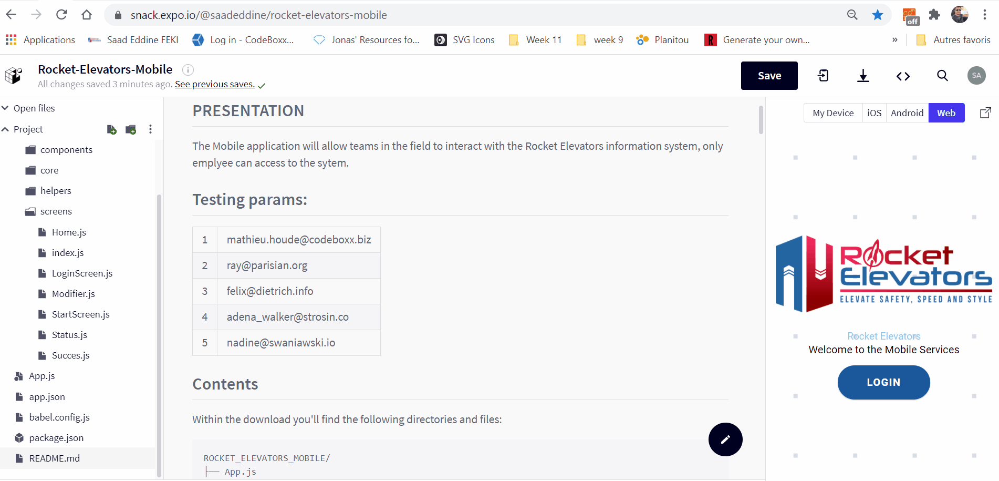

# ROCKET ELEVATORS: Mobile development [WEEK 14]

## PRESENTATION

The Mobile application will allow teams in the field to interact with the Rocket Elevators information system, only emplyee can access to the sytem.

## Testing params:

<table><tbody>
    <tr>
    <td>1</td>
    <td>mathieu.houde@codeboxx.biz</td>
</tr>
<tr>
    <td>2</td>
    <td>ray@parisian.org</td>
</tr>
<tr>
    <td>3</td>
    <td>felix@dietrich.info</td>
</tr>
<tr>
    <td>4</td>
    <td>adena_walker@strosin.co </td>
</tr>
<tr>
    <td>5</td>
    <td>nadine@swaniawski.io</td>
</tr>
</tbody>
</table>

## Contents

Within the download you'll find the following directories and files:

```
ROCKET_ELEVATORS_MOBILE/
├── App.js
├── README.md
├── app.json
├── assets
├── babel.config.js
├── components
│   ├── Buckbutton.js
│   ├── Button.js
│   ├── Header.js
│   ├── Icon.js
│   ├── Card.js
│   ├── Paragraph.js
│   ├── TextInput.js
│   ├── Tabs.js
├── core
│   ├── Theme.js
├── package.json
├── screens
│   ├── Home.js
│   ├── Index.js
│   ├── Login.js
│   ├── Modifier.js
│   ├── StartScreen.js
│   ├── Success.js
│   └── Status.js

```

## How to use?

1. Download or clone this repo.

2. Install dependencies.

```js
npm install
// or
yarn install
```

3. Run project on WEB/ iOS / Android.

```js

 expo start

```

When you run expo start (or npm start), Expo CLI starts Metro Bundler, which is an HTTP server and pops up Expo Dev Tools, a graphical interface for Expo CLI.

## Preview



## Implementation

- React native
- Expo Cli
- Android Studio
- Rest API: C# (over then 36 endpoints to provide data for the systems)

### Happy Coding 🚀

- This project is under license from CodeBoxx.

<h6 align="center">Made with ❤️ in Quebec By Saad eddine</h6>

&#xa0;

<a href="#top">Back to top</a>
